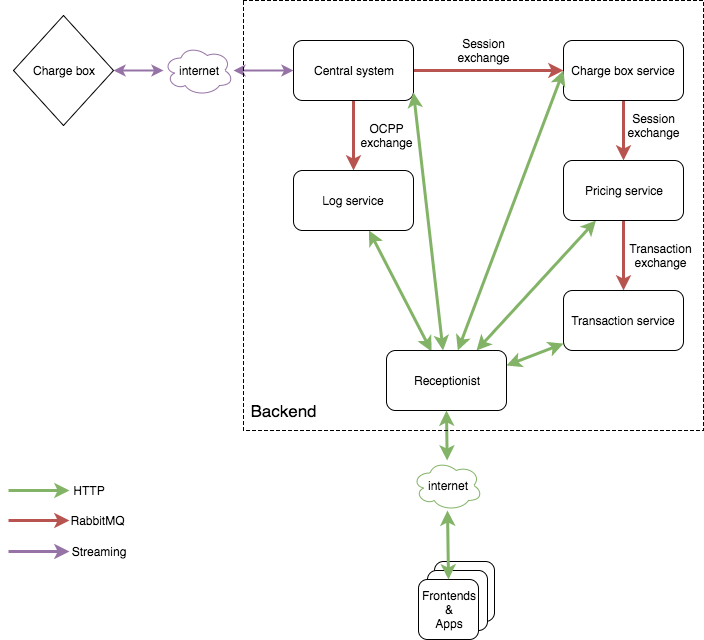

# Architecture

ChargeGrid embraces a microservices approach and asynchronous handling of events to build a scalable system capable of handling many concurrent websocket connections from charge points and API requests from users. Most of ChargeGrid was built in [Clojure](https://clojure.org/) and the code-base embraces a functional but pragmatic approach that values productivity and supports scalable solutions where needed.

## Global overview

ChargeGrid consists of a number of backend systems written as Clojure microservices, that communicate asynchronously over [RabbitMQ](https://www.rabbitmq.com/) queues. Each backend system has their own responsibilities and manages their own data in their own database.

ChargeGrid has 2 entry points to the backend:

- Incoming API requests are handled by [Receptionist](https://github.com/chargegrid/receptionist) that does some permission/role checking and proxies each request to the relevant backend system that can handle that request
- Charge Points connect to [Central System](https://github.com/chargegrid/central-system) using websockets and communicate using the [OCPP](http://www.openchargealliance.org/) protocol.

In the next section you can find descriptions of all the backend systems.

## Services

These are the backend services that make up ChargeGrid, and their responsibilities

#### [Central System](https://github.com/chargegrid/central-system)

**Responsibilities:**

- Handles communication with charge points
- Keeps track of ongoing sessions
- Handles remote commands that need to be executed on charge points

Central-System is the core of ChargeGrid and can easily be scaled by deploying multiple instances [behind a loadbalancer](https://www.haproxy.com/blog/websockets-load-balancing-with-haproxy/)

**Communicates with:**

- [Charge Box Service](https://github.com/chargegrid/charge-box-service): Finished sessions are sent here over RabbitMQ so the proper EVSE-id can be added from the serial/socket combination
- [Log Service](https://github.com/chargegrid/log-service): All raw OCPP messages are sent here to be stored and exposed for maintenance/debugging/etc.

#### [Charge Box Service](https://github.com/chargegrid/charge-box-service)

**Responsibilities:**

- Manage, store and expose charge point information, including EVSEs and sockets
- Manage charge point groups
- Process finished sessions received from Central System, by translating serial/socket combinations to EVSE-ids

**Communicates with:**

- [Central-System](https://github.com/chargegrid/central-system): Receives finished sessions from Central System and processes them
- [Pricing Service](https://github.com/chargegrid/pricing-service): Processed sessions are sent here for price calculation

#### [Pricing Service](https://github.com/chargegrid/pricing-service)

**Responsibilities**

- Manage, store and expose pricing policies and pricing rules
- Calculate prices for incoming sessions, based on pricing rules

**Communicates with:**

- [Charge Box Service](https://github.com/chargegrid/charge-box-service): Receives processed sessions with EVSE-ids from Charge Box Service and calculates prices for them
- [Transaction Service](https://github.com/chargegrid/transaction-service): After prices have been calculated, sessions (which are now complete _transactions_) are sent to the Transaction Service to be processed and stored

#### [Transaction Service](https://github.com/chargegrid/transaction-service)

**Responsilibities:**

- Manage, store and expose complete transactions
- Calculate statistics/aggregates over transactions
- Generate csv files from transactions

**Communicates with:**

- [Pricing Service](https://github.com/chargegrid/pricing-service): Receives priced transactions from the Pricing Service and stores them

#### [Log Service](https://github.com/chargegrid/log-service)

**Responsibilities:**

- Store and expose raw OCPP log messages
- Make OCPP log messages searchable by indexing them

**Communicates with:**

- [Central-System](https://github.com/chargegrid/central-system): Receives raw OCPP log messages from Central System and indexes and stores them

#### [Receptionist](https://github.com/chargegrid/receptionist)

**Responsibilities:**

- API gateway
- Tenant, User and Role management
- Authentication (OAuth) & Authorization using roles and permissions

**Communicates with:** all backend services

## Technologies

For an overview of the technologies used, look [here](technologies.md)

